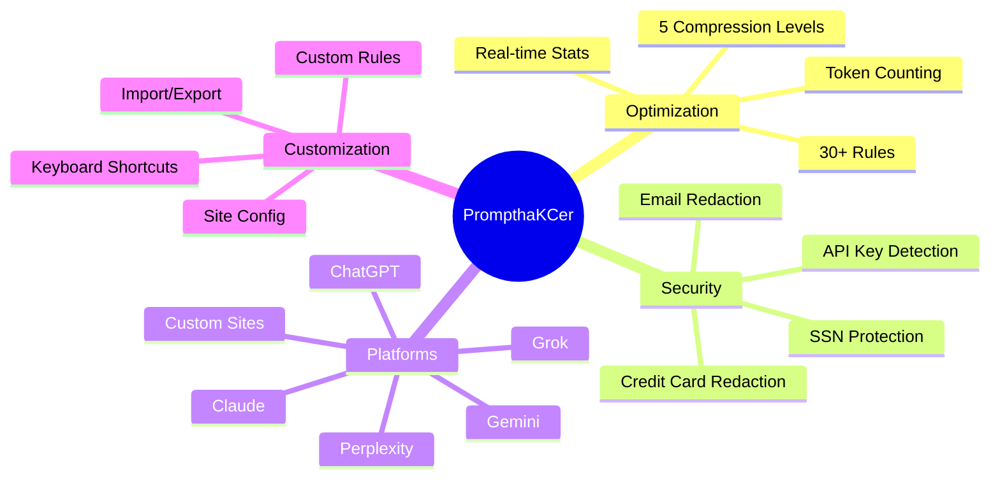
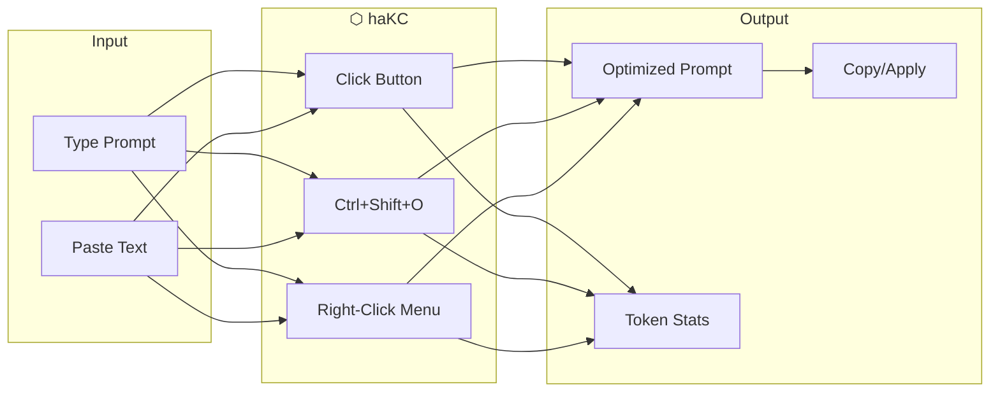
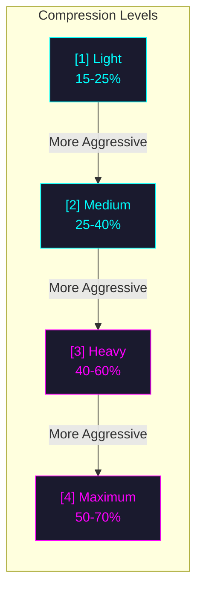
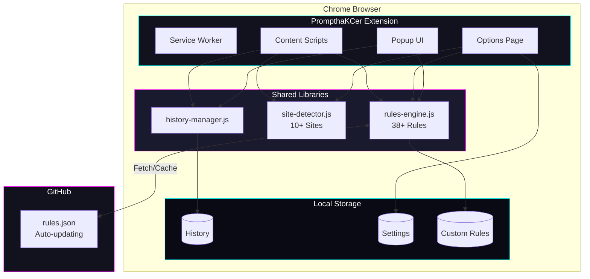
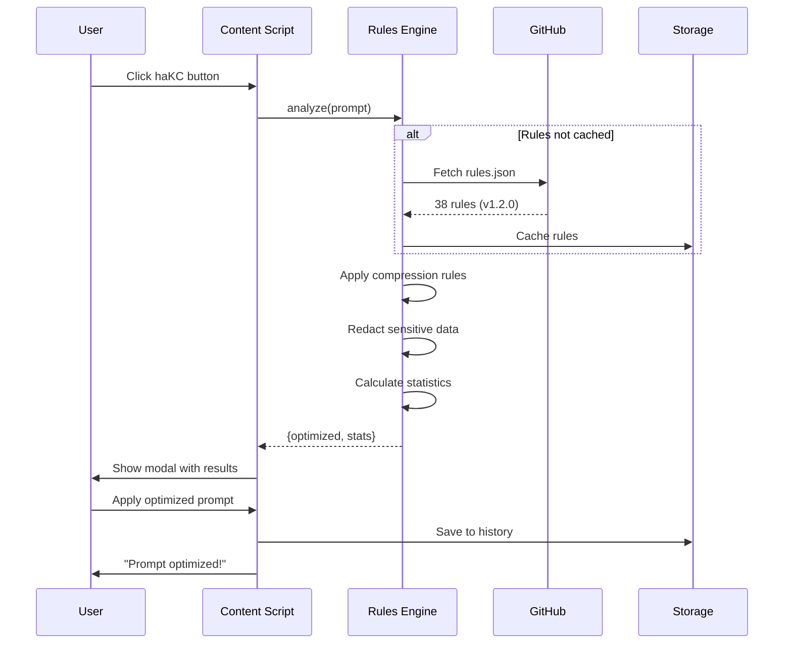

<p align="center">
  
</p>

<p align="center">
  
  <strong><font size="3">Save tokens. Be secure. Write better prompts. It's got a haKC button.</font></strong>
  
</p>

---

<p align="center">
  
  
  
</p>

<p align="center">
  <a href="#-why-you-need-this">Why haKC?</a> •
  <a href="#-features">Features</a> •
  <a href="#-installation">Install</a> •
  <a href="#-usage">Usage</a> •
  <a href="#-compression-levels">Compression</a> •
  <a href="#-supported-sites">Sites</a>
</p>

---

<p align="center">
  <a href="https://github.com/haKC-ai/prompthakcer/releases"></a>
  <a href="https://github.com/haKC-ai/prompthakcer/stargazers"></a>
  <a href="https://github.com/haKC-ai/prompthakcer/issues"></a>
</p>


## ⬡ Why You NEED This


In the age of AI, your prompt is your power. But are you leaking sensitive data? Wasting tokens on fluff? Confusing the model with verbose instructions?

<table>
<tr>
<td width="50%">

### Before haKC
```
Could you please help me? I was wondering
if you could provide a detailed explanation
of how machine learning works. I would
really appreciate it if you could include
some examples. Thank you so much!
```
**~45 tokens**

</td>
<td width="50%">

### After haKC
```
Explain machine learning with examples.
```
**~7 tokens** | **84% reduction**

</td>
</tr>
</table>


| Feature | Benefit |
|---------|---------|
| **DLP Security** | Auto-redact credit cards, emails, SSNs, API keys |
| **Token Savings** | Reduce costs by 15-70% on API calls |
| **Better Responses** | Clear prompts = sharper AI outputs |
| **One Click** | Optimize with hotkey or button |
| **Live Rules** | Auto-updating rules from GitHub |
| **Full Control** | Export all data for your own analysis |

---

## ⬡ Features



### Smart Prompt Optimization
- **Token Savings**: Reduce prompt length by 15-70% without losing meaning
- **5 Compression Levels**: From light formatting to aggressive compression
- **38+ Built-in Rules**: Professionally crafted optimization patterns
- **Real-time Stats**: See exactly how many tokens you're saving

### Universal Compatibility
- **10+ AI Platforms**: ChatGPT, Claude, Gemini, Grok, Perplexity, and more
- **Custom Sites**: Add any AI chat you use
- **Standalone Mode**: Optimize prompts directly in the popup

### Learn and Improve
- **Prompt History**: Review all your optimizations
- **Educational Tips**: Learn better prompting techniques
- **Applied Rules View**: Understand what changed and why
- **Export/Import**: Backup your history and settings

### Fully Customizable
- **Toggle Individual Rules**: Fine-tune which CARE/CRAFT Framework based rule optimizations apply
- **Custom Rules**: Create your own regex-based rules
- **Site Configuration**: Enable/disable for specific platforms
- **Keyboard Shortcuts**: Quick access with `Ctrl+Shift+O`

### Real World Impact Dashboard
See exactly how your optimizations translate to real savings:

| Metric | What You See |
|--------|--------------|
| **Dollar Savings** | Live cost calculations based on enabled AI platforms |
| **Energy Impact** | Compute energy saved with relatable comparisons |
| **Scale Projections** | Potential savings at 10K/100K/1M prompts per day |
| **Beyond Cost** | Latency, context, quality, security benefits |

**Platform Pricing**: Dynamic table showing cost savings per platform based on December 2025 API pricing for ChatGPT, Claude (Sonnet/Opus/Haiku), Gemini, DeepSeek, Grok, Copilot, Perplexity, Poe, and Mistral.

**Energy Comparisons**: Token savings translated to relatable terms like phone charges, LED bulb hours, laptop runtime, and EV miles.

---

## ⬡ Installation

### From Chrome Web Store
<a href="https://chromewebstore.google.com/detail/prompt-hakcer-hakc-your-p/ihdhaipofhijolleameimgfmmafgpncp?hl=en-US"></a>

1. Visit the [PrompthaKCer Chrome Web Store page](#)
2. Click "Add to Chrome"
3. Click "Add Extension" to confirm

### From Source (Developer Mode)

```bash
# Clone the repository
git clone https://github.com/haKC-ai/prompthakcer.git

# Navigate to chrome://extensions/
# Enable "Developer mode"
# Click "Load unpacked"
# Select the prompthakcer folder
```

---

## ⬡ Usage



### On AI Chat Pages
1. Navigate to any supported AI chat (ChatGPT, Claude, etc.)
2. Type your prompt in the input field
3. Click the **⬡ haKC** button or press `Ctrl+Shift+O`
4. Review the optimized version
5. Click "Apply" to use it

### Standalone Mode (Popup)
1. Click the PrompthaKCer icon in your toolbar
2. Paste or type your prompt
3. Choose compression level with the slider
4. Click "Optimize"
5. Copy the result

---

## ⬡ Compression Levels



| Level | Description | Savings | Best For |
|:-----:|-------------|:-------:|----------|
| **Light** | Remove obvious fluff, keep tone | 15-25% | Professional emails |
| **Medium** | Balanced optimization | 25-40% | General use |
| **Heavy** | Aggressive compression | 40-60% | API calls |
| **Maximum** | Extreme reduction | 50-70% | Token-limited contexts |

### What Gets Optimized?

| Category | Before | After |
|----------|--------|-------|
| **Fluff** | "Could you please help me..." | "Help me..." |
| **Fillers** | "just", "really", "very", "basically" | *(removed)* |
| **Redundancy** | "I want you to write..." | "Write..." |
| **Verbose** | "in order to" | "to" |
| **Structure** | "provide a detailed explanation of" | "explain:" |
| **Security** | "4532-1234-5678-9012" | "[REDACTED]" |

---

## ⬡ Supported Sites

<p align="center">
  
  
  
  
  
</p>

| Platform | URLs | Status |
|----------|------|:------:|
| **ChatGPT** | chat.openai.com, chatgpt.com | ✅ |
| **Claude** | claude.ai | ✅ |
| **Gemini** | gemini.google.com | ✅ |
| **Grok** | grok.x.ai, x.com/i/grok | ✅ |
| **Perplexity** | perplexity.ai | ✅ |
| **Copilot** | copilot.microsoft.com | ✅ |
| **Poe** | poe.com | ✅ |
| **HuggingFace** | huggingface.co/chat | ✅ |
| **You.com** | you.com | ✅ |
| **Phind** | phind.com | ✅ |
| **Custom** | *Any URL you add* | ✅ |

---

## ⬡ Architecture



### Data Flow



---

## ⬡ Custom Rules

Create your own optimization rules in **Settings > Rules > Add Custom Rule**:

```javascript
// Example: Remove all emoji
{
  name: "Remove Emoji",
  pattern: "[\\u{1F300}-\\u{1F9FF}]",
  flags: "gu",
  replace: ""
}

// Example: Shorten common phrase
{
  name: "Shorten Please Note",
  pattern: "please note that",
  flags: "gi",
  replace: "note:"
}
```

---

## ⬡ Keyboard Shortcuts

| Shortcut | Action |
|----------|--------|
| `Ctrl+Shift+O` | Optimize prompt on page |
| `Alt+P` | Open popup |

Customize at `chrome://extensions/shortcuts`

---

## ⬡ Privacy

<p align="center">
  
  
  
</p>

- **100% Local**: All processing happens in your browser
- **No Data Collection**: We don't collect any user data
- **No External Servers**: Your prompts never leave your device
- **Open Source**: Full code transparency
- **Export/Delete**: Full control over your history

---

## ⬡ Project Structure

```
prompthakcer/
├── manifest.json           # Chrome extension manifest (MV3)
├── rules.json              # Remote-synced optimization rules
├── background/
│   └── service-worker.js   # Background service worker
├── content/
│   ├── content.js          # Content script for AI sites
│   └── modal.css           # On-page modal styles
├── lib/
│   ├── rules-engine.js     # Core optimization engine
│   ├── site-detector.js    # Site detection and config
│   └── history-manager.js  # History management
├── popup/
│   ├── popup.html/css/js   # Extension popup
├── options/
│   ├── options.html/css/js # Settings page
└── icons/
    └── icon*.png           # Extension icons
```

---

## ⬡ Contributing

<p align="center">
  <a href="https://github.com/haKC-ai/prompthakcer/issues/new?template=bug_report.md"></a>
  <a href="https://github.com/haKC-ai/prompthakcer/issues/new?template=feature_request.md"></a>
  <a href="https://github.com/haKC-ai/prompthakcer/pulls"></a>
</p>

1. **Report Bugs**: Open an issue with reproduction steps
2. **Suggest Features**: We'd love to hear your ideas
3. **Submit PRs**: Bug fixes and improvements welcome
4. **Share Rules**: Contribute useful optimization patterns

---

## ⬡ Support

<p align="center">
  <a href="https://github.com/haKC-ai/prompthakcer/issues"></a>
  <a href="mailto:cory@hakc.ai"></a>
</p>

---

<p align="center">
  
  <br>
  <strong>Don't just chat. haKC.</strong>
  <br>
  <sub>Made with ⬡ by <a href="https://hakc.ai">haKC.ai</a></sub>
</p>
