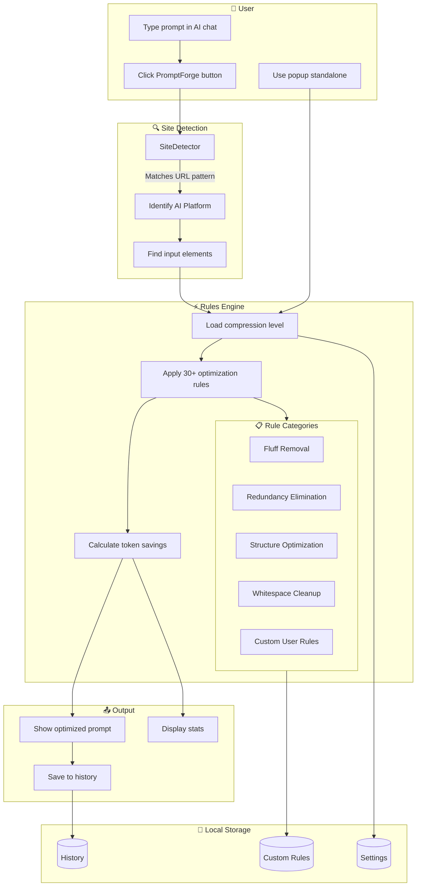
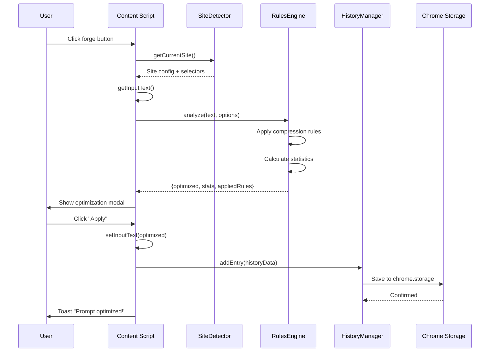
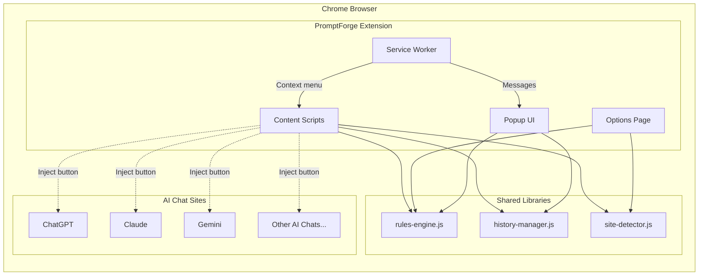

# PromptForge - AI Prompt Optimizer

<p align="center">
  
</p>

<p align="center">
  <strong>Save tokens. Write better prompts. Supercharge your AI conversations.</strong>
</p>

<p align="center">
  <a href="#features">Features</a> |
  <a href="#installation">Installation</a> |
  <a href="#usage">Usage</a> |
  <a href="#compression-levels">Compression</a> |
  <a href="#custom-rules">Custom Rules</a> |
  <a href="#supported-sites">Sites</a>
</p>

---

## Features

### Smart Prompt Optimization
- **Token Savings**: Reduce prompt length by 15-70% without losing meaning
- **5 Compression Levels**: From light formatting to aggressive compression
- **30+ Built-in Rules**: Professionally crafted optimization patterns
- **Real-time Stats**: See exactly how many tokens you're saving

### Universal Compatibility
- **10+ AI Platforms**: ChatGPT, Claude, Gemini, Grok, Perplexity, and more
- **Custom Sites**: Add any AI chat you use
- **Standalone Mode**: Optimize prompts directly in the popup

### Learn and Improve
- **Prompt History**: Review all your optimizations
- **Educational Tips**: Learn better prompting techniques
- **Applied Rules View**: Understand what changed and why
- **Export/Import**: Backup your history and settings

### Fully Customizable
- **Toggle Individual Rules**: Fine-tune which optimizations apply
- **Custom Rules**: Create your own regex-based rules
- **Site Configuration**: Enable/disable for specific platforms
- **Keyboard Shortcuts**: Quick access with Ctrl+Shift+O

---

## Installation

### From Chrome Web Store
1. Visit the [PromptForge Chrome Web Store page](#)
2. Click "Add to Chrome"
3. Click "Add Extension" to confirm

### From Source (Developer Mode)
1. Download or clone this repository
2. Open Chrome and go to `chrome://extensions/`
3. Enable "Developer mode" (top right toggle)
4. Click "Load unpacked"
5. Select the `promptforge` folder
6. The extension icon appears in your toolbar

---

## Usage

### On AI Chat Pages
1. Navigate to any supported AI chat (ChatGPT, Claude, etc.)
2. Type your prompt in the input field
3. Click the forge button or press `Ctrl+Shift+O`
4. Review the optimized version
5. Click "Apply" to use it

### Standalone Mode (Popup)
1. Click the PromptForge icon in your toolbar
2. Paste or type your prompt
3. Choose compression level
4. Click "Optimize Prompt"
5. Copy the result

### Right-Click Context Menu
1. Select text anywhere on a page
2. Right-click and select "Optimize with PromptForge"
3. The optimized text is copied to clipboard

---

## Compression Levels

| Level | Icon | Description | Token Savings |
|-------|------|-------------|---------------|
| **None** | 1 | Formatting cleanup only | 5-10% |
| **Light** | 2 | Remove obvious fluff | 15-25% |
| **Medium** | 3 | Balanced optimization (recommended) | 25-40% |
| **Heavy** | 4 | Aggressive compression | 40-60% |
| **Maximum** | 5 | Extreme compression | 50-70% |

### What Gets Optimized?

**Fluff Removal**
- "Could you please help me..." becomes "Help me..."
- "I was wondering if..." is removed
- "just", "really", "very", "basically" are removed

**Redundancy Elimination**
- "I want you to write..." becomes "Write..."
- "in order to" becomes "to"
- "due to the fact that" becomes "because"

**Structure Optimization**
- "provide a detailed explanation of" becomes "explain in detail:"
- "create a list of" becomes "list:"

---

## Custom Rules

Create your own optimization rules in Settings > Custom Rules:

### Example: Remove Emoji
```
Name: Remove Emoji
Pattern: [\u{1F300}-\u{1F9FF}]
Flags: gu
Replace: (empty)
```

### Example: Shorten "Please note that"
```
Name: Shorten Please Note
Pattern: please note that
Flags: gi
Replace: note:
```

### Example: Remove Timestamps
```
Name: Remove Timestamps
Pattern: \[\d{1,2}:\d{2}(:\d{2})?\]
Flags: g
Replace: (empty)
```

---

## Supported Sites

### Built-in Support
| Site | Status |
|------|--------|
| ChatGPT (chat.openai.com, chatgpt.com) | Supported |
| Claude (claude.ai) | Supported |
| Gemini (gemini.google.com) | Supported |
| Grok (grok.x.ai, x.com/i/grok) | Supported |
| Perplexity (perplexity.ai) | Supported |
| Microsoft Copilot | Supported |
| Poe (poe.com) | Supported |
| HuggingFace Chat | Supported |
| You.com | Supported |
| Phind | Supported |

### Add Custom Sites
1. Go to Settings > Sites
2. Enter site name and URL patterns
3. Optionally specify input selectors
4. Click "Add Site"

---

## Keyboard Shortcuts

| Shortcut | Action |
|----------|--------|
| `Ctrl+Shift+O` | Optimize current prompt on page |
| `Alt+P` | Open PromptForge popup |

Customize shortcuts at `chrome://extensions/shortcuts`

---

## How It Works



### Data Flow



### Architecture Overview



---

## Project Structure

```
promptforge/
├── manifest.json           # Chrome extension manifest (MV3)
├── background/
│   └── service-worker.js   # Background service worker
├── content/
│   ├── content.js          # Content script for AI sites
│   └── modal.css           # On-page modal styles
├── lib/
│   ├── rules-engine.js     # Core optimization engine
│   ├── site-detector.js    # Site detection and configuration
│   └── history-manager.js  # History and stats management
├── popup/
│   ├── popup.html          # Extension popup
│   ├── popup.css           # Popup styles
│   └── popup.js            # Popup logic
├── options/
│   ├── options.html        # Settings page
│   ├── options.css         # Settings styles
│   └── options.js          # Settings logic
├── icons/
│   ├── icon16.png
│   ├── icon32.png
│   ├── icon48.png
│   └── icon128.png
└── README.md
```

---

## Privacy

PromptForge respects your privacy:

- **100% Local**: All processing happens in your browser
- **No Data Collection**: We don't collect any user data
- **No External Servers**: Your prompts never leave your device
- **Open Source**: Full code transparency

Your prompt history is stored locally using Chrome's storage API and can be exported or deleted at any time.

---

## Contributing

Contributions are welcome! Here's how you can help:

1. **Report Bugs**: Open an issue with reproduction steps
2. **Suggest Features**: We'd love to hear your ideas
3. **Submit PRs**: Bug fixes and improvements welcome
4. **Share Rules**: Contribute useful custom rules

---

## Changelog

### v1.0.0 (Initial Release)
- 30+ built-in optimization rules
- 5 compression levels
- Support for 10+ AI platforms
- Custom site configuration
- Custom rule creation
- Prompt history with export/import
- Educational learning section
- Context menu integration
- Keyboard shortcuts

---

## License

MIT License - feel free to modify and distribute.

---

## Support

- **Issues**: https://github.com/haKC-ai/promptforge/issues
- **Email**: cory@hakc.ai

---

<p align="center">
  Made with care for efficient prompting
</p>
